# CNN for Age and Gender Recognition

This project explores two methods for classifying age and gender from facial images: a **custom Convolutional Neural Network (CNN)** and a **pre-trained CNN** using transfer learning. The models were trained on a subset of the UTKFace dataset.

The project was completed by Dario Cline (dc903) and Germain McCaulay-Jones (gmj32).

---

## Web Application

The model can be easily run via a containerised web application.

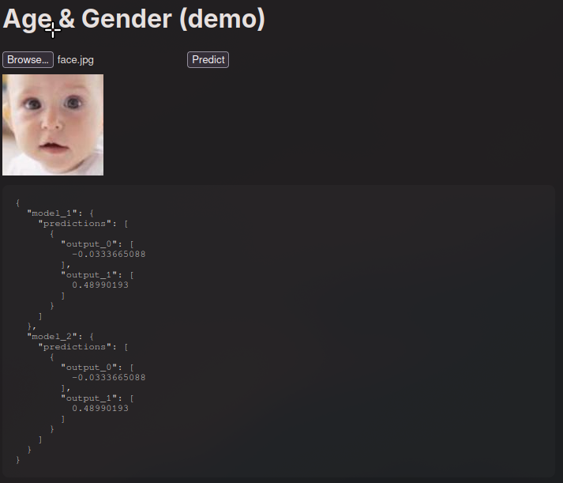

For more information refer to `application/README.md`.

---

## 🚀 Getting Started

The Keras model files are available at the following links:

* **Custom CNN (Model A):** [age_gender_A keras file](https://drive.google.com/file/d/198wLmX6aJn18K-_UirdRHog-y1EYGa0x/view?usp=sharing)

* **Pre-trained CNN (Model B):** [age_gender_B keras file](https://drive.google.com/file/d/1lFd-2I3J-o9HCtBCnYpESllyQhhput5V/view?usp=sharing)

---

## 🧠 Model Architectures

### Custom CNN (Model A)

This model was built from scratch, taking inspiration from the AlexNet architecture. It was optimized for the given dataset size.

* **Architecture:** A custom CNN with approximately **500K trainable parameters**. It uses Leaky GELU activation functions and incorporates batch normalization to stabilize training.

* **Training:**

    * **Optimizer:** AdamW

    * **Loss Functions:** Mean Squared Error (MSE) for age and Binary Cross-Entropy (BCE) for gender. The BCE loss was weighted **100:1** to address low relative BCE values and improve gender accuracy.

    * **Regularization:** Early stopping was used to prevent overfitting, with a maximum of 100 epochs.

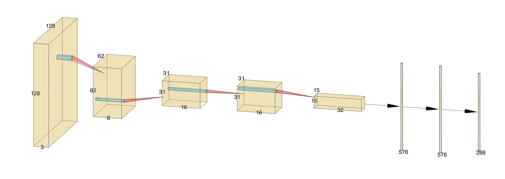
*Figure 1: Our proposed model architecture for the custom CNN (model 4 mini). Normalisation and max pooling layers have been omitted.*

---

### Pre-trained CNN (Model B)

This model uses **transfer learning** with a pre-trained CNN to leverage existing feature-extraction capabilities.

* **Pre-trained Model:** Xception was chosen for its strong performance.

* **Architecture:** The convolutional base of the Xception model was used for feature extraction. The final **18 layers of Xception** were unfrozen for fine-tuning, with a linear layer (256 units) and two output heads added for age and gender. The model has **7.3 million trainable parameters**.

* **Training:**

    * **Optimizer:** AdamW

    * **Loss Functions:** Mean Squared Error (MSE) for age and Binary Cross-Entropy (BCE) for gender. The BCE loss was weighted **25:1**.

    * **Regularization:** Early stopping was used with a maximum of 200 epochs.
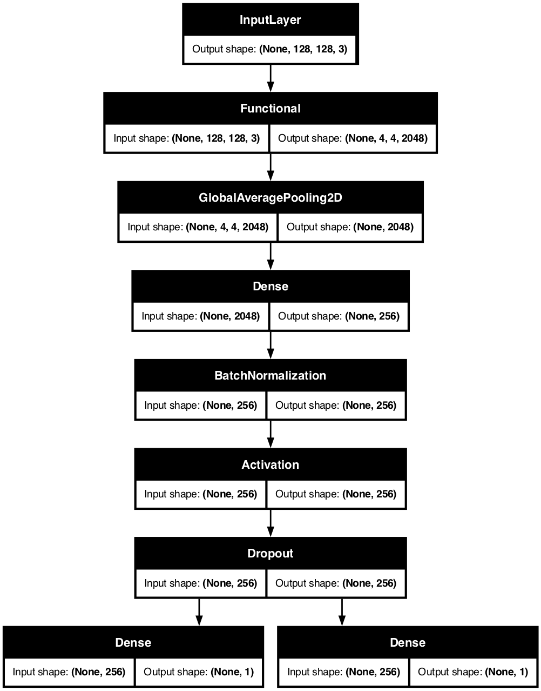
*Figure 2: Model B (Pre-trained Model) Architecture.*

---

## ✅ Results and Evaluation

### Custom CNN (Model A)

| Metric | Age MAE | Gender Accuracy |
| ------ | ------- | --------------- |
| **Validation** | 7.56 | 86.0% |

The training and validation losses converged well but showed some volatility. The model demonstrated a slight tendency to overestimate age, which was consistent across genders. It also showed a tendency to underestimate the age of females over 40, likely due to data imbalance.

**Gender-specific Metrics:**

| Metric | Recall | True Negative Rate | Precision | F1 Score |
| ------ | ------ | ------------------ | --------- | -------- |
| **Male** | 0.8548 | 0.8651 | 0.8618 | 0.8583 |
| **Female** | 0.8651 | 0.8548 | 0.8583 | 0.8617 |

*Figure 3: Training and Validation Loss for the custom CNN.*

---

### Pre-trained CNN (Model B)

| Metric | Age MAE | Gender Accuracy |
| ------ | ------- | --------------- |
| **Validation** | 6.88 | 86.8% |

This model achieved better age MAE and slightly better gender accuracy than the custom CNN. The training and validation losses showed good convergence. Similar to Model A, the model showed a tendency to underestimate the age of females, particularly those over 60, likely due to the dataset's imbalanced distribution.

**Gender-specific Metrics:**

| Metric | Recall | True Negative Rate | Precision | F1 Score |
| ------ | ------ | ------------------ | --------- | -------- |
| **Male** | 0.9073 | 0.8294 | 0.8396 | 0.8721 |
| **Female** | 0.8294 | 0.9073 | 0.9009 | 0.8636 |

*Figure 4: Training and Validation Loss for the Pre-trained CNN.*

## 👽 Extras

### Gender Bias (Predicted Age to Actual Age Distribution)

    

        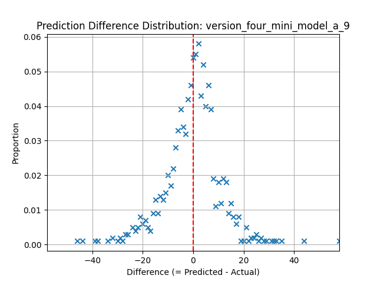
        
<em>Figure X: Distribution in Difference in Predicted Age to Actual Age (Overall)</em>

    

    

        
        
<em>Figure Y: Distribution of Difference in Predicted Age to Actual Age (Female Only)</em>

    

    

        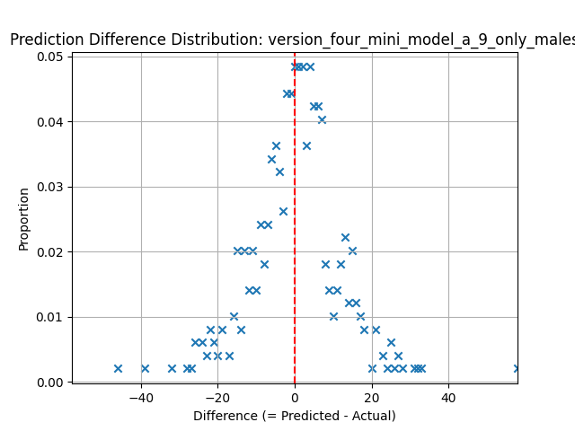
        
<em>Figure Z: Distribution of Difference in Predicted Age to Actual Age (Male Only)</em>

    

    

        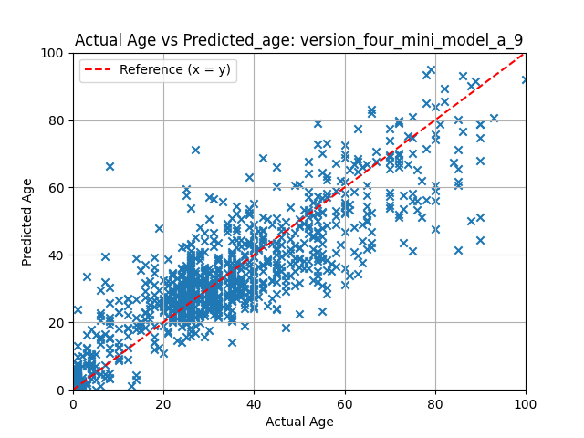
        
<em>Figure P: Validation Set Age to Predicted (Overall)</em>

    

    

        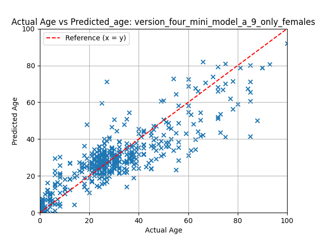
        
<em>Figure Q: Validation Set Age to Predicted Age (Female Only)</em>

    

    

        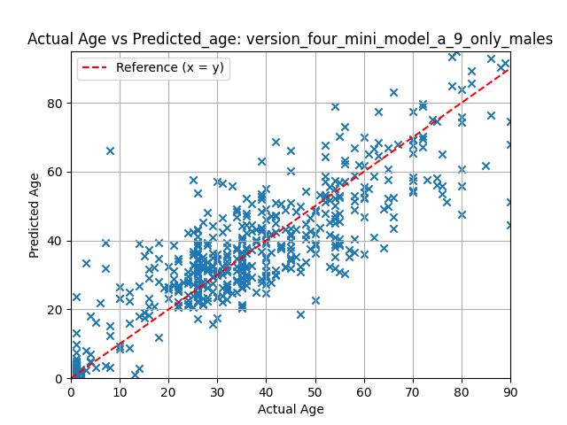
        
<em>Figure R: Validation Set Age to Predicted (Male Only)</em>

    

*Model A Predicted Age to Age in the Validation Set by Gender*

    

        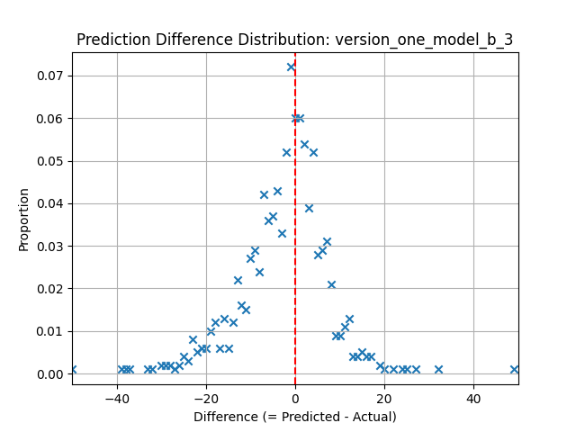
        
<em>Figure X: Distribution in Difference in Predicted Age to Actual Age (Overall)</em>

    

    

        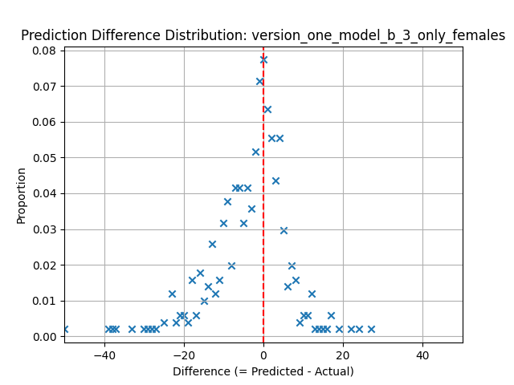
        
<em>Figure Y: Distribution of Difference in Predicted Age to Actual Age (Female Only)</em>

    

    

        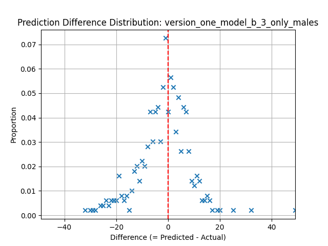
        
<em>Figure Z: Distribution of Difference in Predicted Age to Actual Age (Male Only)</em>

    

    

        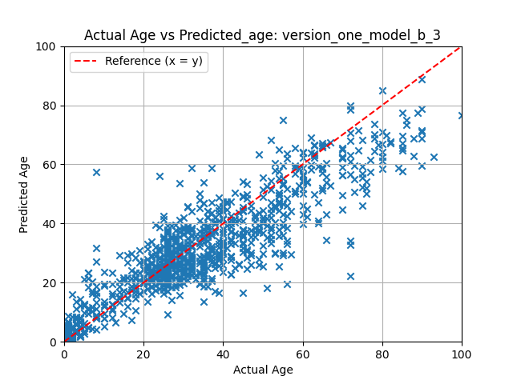
        
<em>Figure P: Validation Set Age to Predicted (Overall)</em>

    

    

        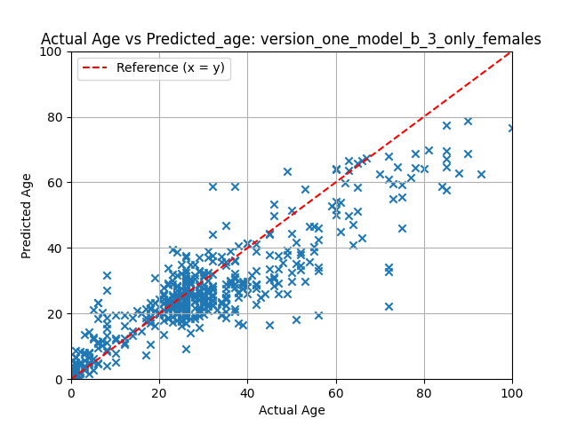
        
<em>Figure Q: Validation Set Age to Predicted Age (Female Only)</em>

    

    

        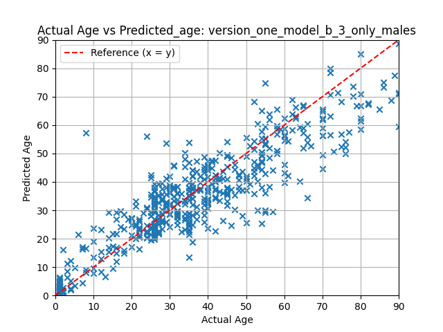
        
<em>Figure R: Validation Set Age to Predicted (Male Only)</em>

    

*Model B Predicted Age to Age in the Validation Set by Gender*
